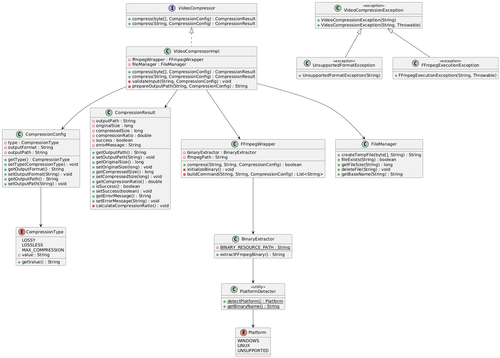
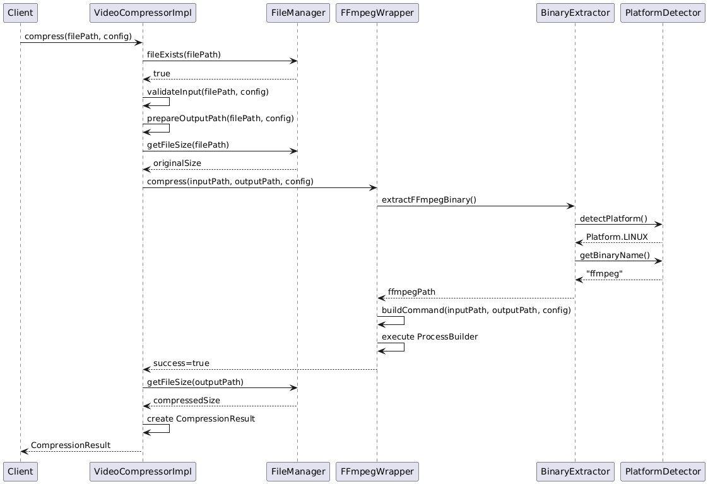
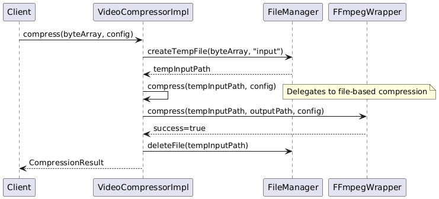
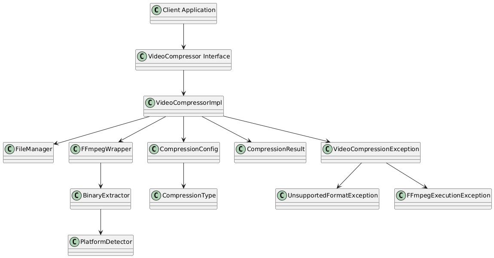
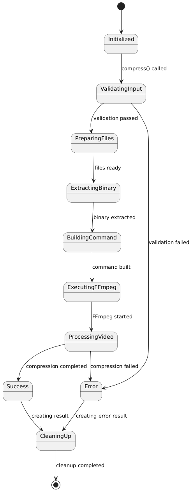
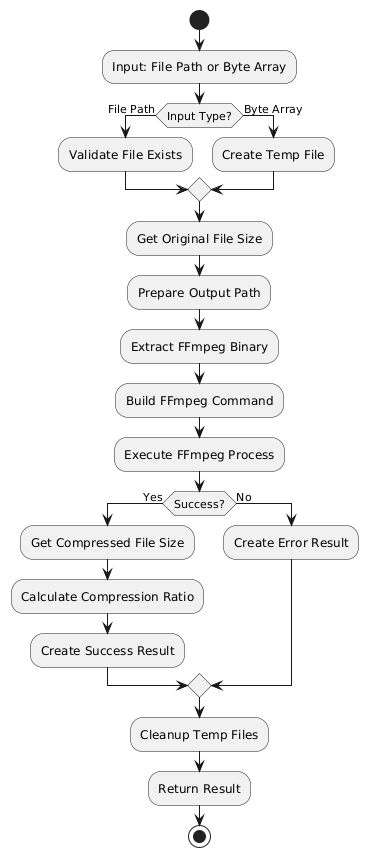
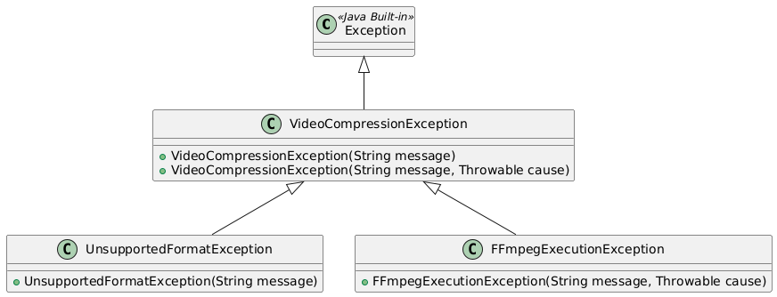
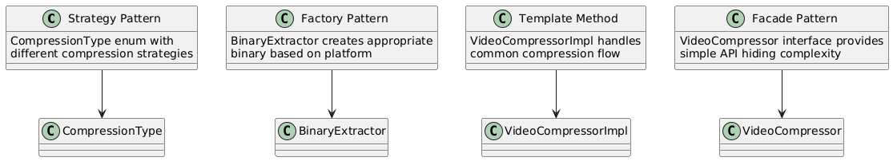

# Low-Level Design Document: Java Video Compression Library

## 1. Package Structure

```
com.videocompression
├── api/
│   ├── VideoCompressor (interface)
│   ├── CompressionConfig
│   ├── CompressionResult
│   └── CompressionType (enum)
├── impl/
│   ├── VideoCompressorImpl
│   ├── FFmpegWrapper
│   └── FileManager
├── util/
│   ├── PlatformDetector
│   └── BinaryExtractor
└── exception/
    ├── VideoCompressionException
    ├── UnsupportedFormatException
    └── FFmpegExecutionException
```

## 2. Class Diagram



## 3. Sequence Diagram - File Path Compression



## 4. Sequence Diagram - Byte Array Compression



## 5. Component Interaction Diagram



## 6. State Diagram - Compression Process



## 7. Activity Diagram - Data Flow



## 8. Exception Hierarchy



## 9. Resource Structure

```
src/main/resources/
└── binaries/
    ├── ffmpeg.exe      (Windows binary)
    └── ffmpeg          (Linux binary)
```

## 10. Key Design Patterns Used



## 11. Diagram Files

All PlantUML source files are available in the `diagrams/` folder:
- `class-diagram.puml` - Main class relationships
- `sequence-file-compression.puml` - File path compression flow
- `sequence-byte-compression.puml` - Byte array compression flow
- `component-interaction.puml` - Component relationships
- `state-diagram.puml` - Process state transitions
- `activity-diagram.puml` - Data flow activities
- `exception-hierarchy.puml` - Exception class hierarchy
- `design-patterns.puml` - Design patterns visualization
